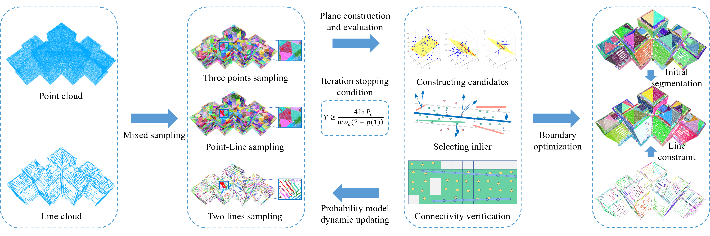

# Unify Points and Lines for Efficient and Accurate Plane Segmentation

A high-performance implementation of RANSAC algorithm for robust plane detection in 3D point clouds and line segments with flexible input modes.

[](https://opensource.org/licenses/MIT)
[](https://en.wikipedia.org/wiki/C%2B%2B17)
[](#)

## Overview

This project implements an efficient RANSAC-based algorithm specifically designed for **plane detection** in 3D data. The algorithm supports flexible input modes and can process point clouds, line segments, or both simultaneously for robust plane segmentation.

### Algorithm Workflow



The algorithm follows a comprehensive pipeline designed for robust plane detection with flexible input processing:

1. **Input Processing**: Accepts point clouds, line segments, or both as input data
2. **Adaptive Sampling**: Implements three sampling strategies based on input type:
   - **Point-only mode**: Three-point sampling for plane estimation
   - **Line-only mode**: Two-line sampling for plane construction
   - **Combined mode**: Mixed point-line sampling for enhanced robustness
3. **Plane Construction & Evaluation**: Constructs candidate planes and evaluates fitness
4. **Iterative Optimization**: Uses dynamic probability models with adaptive termination
5. **Boundary Refinement**: Applies line constraints and connectivity verification
6. **Plane Segmentation**: Outputs refined plane segmentation results

### Features

- **Flexible Input Modes**: Supports three input configurations:
  - Point cloud only processing
  - Line segments only processing  
  - Combined point cloud and line segment processing
- **Specialized Plane Detection**: Optimized RANSAC algorithm specifically for plane segmentation
- **High-performance Implementation**: Multi-threaded execution with OpenMP acceleration
- **Advanced Sampling Strategies**: Multiple sampling methods for different input types
- **Memory Efficient**: Optimized spatial indexing with octree-based data structures

## Requirements

- C++17 compatible compiler (GCC 9.0+, MSVC 19.28+, Clang 10.0+)
- CMake 3.16 or higher
- Required libraries: Eigen3, PCL, VTK, OpenMP, CERES, NLopt, TBB, BLAS/LAPACK

See `DEPENDENCIES.md` for detailed installation instructions.

## Building

```bash
git clone https://github.com/dreamer198/PSUPL.git
cd PSUPL
mkdir build && cd build
cmake .. -DCMAKE_BUILD_TYPE=Release
make -j$(nproc)
```

## Data Format

Input data should be in .obj format with point cloud vertices and line segments.

## Performance

Optimized for large-scale point cloud processing with multi-threading support.

## License

This project is licensed under the MIT License - see the [LICENSE](LICENSE) file for details.